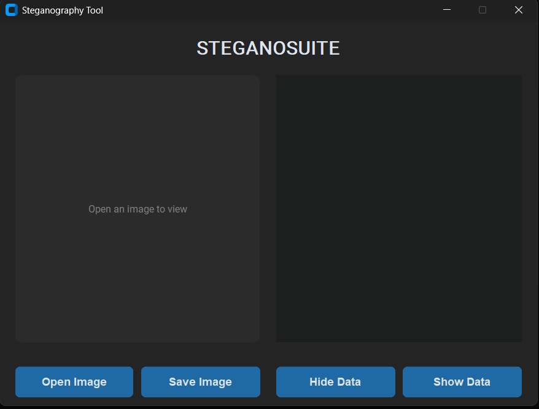
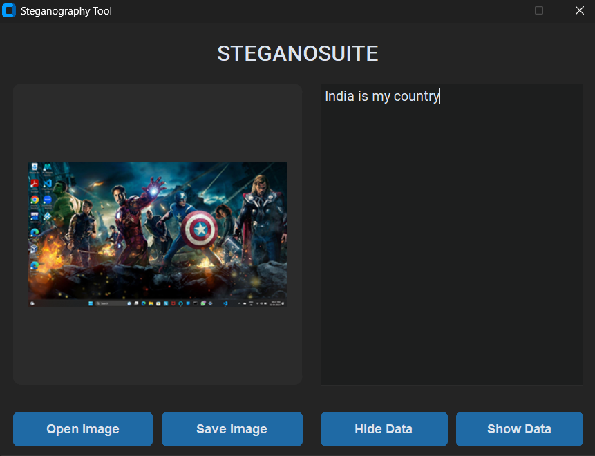

# Steganography Tool

A modern desktop application built with Python and `customtkinter` that allows you to hide secret text messages within images using the Least Significant Bit (LSB) steganography technique.

## Features

* **Modern UI**: A clean and intuitive user interface built with the `customtkinter` library.
* **Open & Preview Images**: Easily load and preview PNG or JPG image files.
* **Hide Text**: Embed any text message securely into the selected image.
* **Reveal Text**: Extract the hidden message from a stego-image.
* **Save Stego-Image**: Save the new image containing the hidden data to your local machine.
* **User-Friendly Feedback**: Clear success and error messages to guide the user.

## Screenshots

Here's a look at the application in action.

## 📸 Screenshots

Here's a look at the application in action.

**Main Window:**


**Hiding a Message:**


## Technologies Used

* **Python 3**: The core programming language.
* **CustomTkinter**: For creating the modern graphical user interface.
* **Pillow (PIL)**: For image manipulation and processing.
* **Stegano**: For the core LSB steganography logic.
* **CTkMessagebox**: For displaying modern, themed message boxes.

## Setup and Installation

To run this application on your local machine, follow these steps:

1.  **Clone the repository:**
    ```
    git clone https://github.com/premc5731/STEGANOGRAPHY-TOOL.git
    ```

2.  **Install the required libraries:**
    ```
    customtkinter
    Pillow
    steganography
    CTkMessagebox
    ```

3.  **Run the application:**
    ```
    python Steganography_Tool.py
    ```

## How to Use

1.  **Open Image**: Click the **"Open Image"** button to select a `.png` or `.jpg` file from your computer. The image will be displayed on the left.
2.  **Hide Data**:
    * Type the secret message you want to hide into the text box on the right.
    * Click the **"Hide Data"** button. A confirmation message will appear.
3.  **Save Image**:
    * After hiding data, click the **"Save Image"** button.
    * A file dialog will open, allowing you to choose a location and name for your new stego-image.
4.  **Show Data**:
    * Open a stego-image that you suspect contains a hidden message.
    * Click the **"Show Data"** button. The hidden message will be revealed in the text box.

## License

This project is licensed under the **MIT License**. See [LICENSE](LICENSE) for more info.